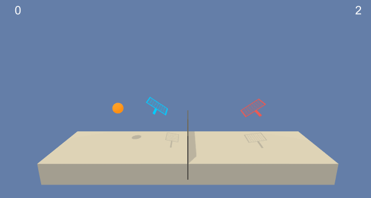
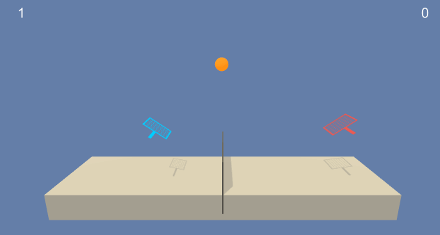

Unity ML-Agents Tennis Environment
========================================


## Untrained Agent


## Trained Agent



This project aims to solve the Unity Tennis Environment (see `Environment Details`) using Multi Agent Deep Reinforcement Learning (specifically, using MADDPG - Multi-Agent Deep Deterministic Policy Gradient). 

## Environment Details

In this environment, two agents control rackets to bounce a ball over a net. If an agent hits the ball over the net, it receives a reward of +0.1. If an agent lets a ball hit the ground or hits the ball out of bounds, it receives a reward of -0.01. Thus, the goal of each agent is to keep the ball in play.

The observation space consists of 24 variables corresponding to the position and velocity of the ball and racket. Each agent receives its own, local observation. Two continuous actions are available, corresponding to movement toward (or away from) the net, and jumping.

The task is episodic, and in order to solve the environment, the agents must get an average score of +0.5 (over 100 consecutive episodes, after taking the maximum over both agents). Specifically,

	- After each episode, add up the rewards that each agent received (without discounting), to get a score for each agent. This yields 2 (potentially different) scores. Then take the maximum of these 2 scores.
	- This yields a single score for each episode.

The environment is considered solved, when the average (over 100 episodes) of those scores is at least +0.5.

- Set-up: Two-player game where agents control rackets to bounce ball over a net.
- Goal: The agents must bounce ball between one another while not dropping or sending ball out of bounds.
- Agents: The environment contains two agent linked to a single Brain named TennisBrain. After training you can attach another Brain named MyBrain to one of the agent to play against your trained model.
- Agent Reward Function (independent):
	- +0.1 To agent when hitting ball over net.
	- -0.01 To agent who let ball hit their ground, or hit ball out of bounds.
- Brains: One Brain with the following observation/action space (per agent).
	- Vector Observation space: 24 variables corresponding to position and velocity of ball and racket.
	- Vector Action space: (Continuous) Size of 2, corresponding to movement toward net or away from net, and jumping.
- Visual Observations: None.
- Reset Parameters: One, corresponding to size of ball.
- Benchmark Mean Reward: 2.5


## Requirements

- Python 3.5 or higher ([Anaconda](https://www.anaconda.com/download/#macos))
- [NumPy](http://www.numpy.org/)
- [PyTorch](https://pytorch.org/) 
- [UnityAgents](https://github.com/Unity-Technologies/ml-agents)
- [OpenAI Gym](https://gym.openai.com/)
- The Reacher Environment: 
	- [Linux](environment/)
	- [Mac OSX](environment/)
	- [Windows 32-bit](environment/)
	- [Windows 64-bit](environment/)

	Alternatively, in the `environment` folder download and unzip the appropriate file for Linux/Mac OSX/Windows 32-bit/Windows 64-bit.

## Run

Run the following command on the terminal; doing so will pop up a window on your default browser which you can then use to explore the `Solution.ipynb` file to learn how to train the agent and run the code.

```shell
$ jupyter notebook
```


## References
- [Ryan Lowe, Yi Wu, Aviv Tamar, Jean Harb, Pieter Abbeel, Igor Mordatch, 
Multi-Agent Actor-Critic for Mixed Cooperative-Competitive Environments.](https://arxiv.org/abs/1706.02275)
- Richard S. Sutton and Andrew G. Barto. Reinforcement Learning: An Introduction.

## License

MIT License

Copyright (c) 2018 Uirá Caiado

Permission is hereby granted, free of charge, to any person obtaining a copy
of this software and associated documentation files (the "Software"), to deal
in the Software without restriction, including without limitation the rights
to use, copy, modify, merge, publish, distribute, sublicense, and/or sell
copies of the Software, and to permit persons to whom the Software is
furnished to do so, subject to the following conditions:

The above copyright notice and this permission notice shall be included in all
copies or substantial portions of the Software.

THE SOFTWARE IS PROVIDED "AS IS", WITHOUT WARRANTY OF ANY KIND, EXPRESS OR
IMPLIED, INCLUDING BUT NOT LIMITED TO THE WARRANTIES OF MERCHANTABILITY,
FITNESS FOR A PARTICULAR PURPOSE AND NONINFRINGEMENT. IN NO EVENT SHALL THE
AUTHORS OR COPYRIGHT HOLDERS BE LIABLE FOR ANY CLAIM, DAMAGES OR OTHER
LIABILITY, WHETHER IN AN ACTION OF CONTRACT, TORT OR OTHERWISE, ARISING FROM,
OUT OF OR IN CONNECTION WITH THE SOFTWARE OR THE USE OR OTHER DEALINGS IN THE
SOFTWARE.

