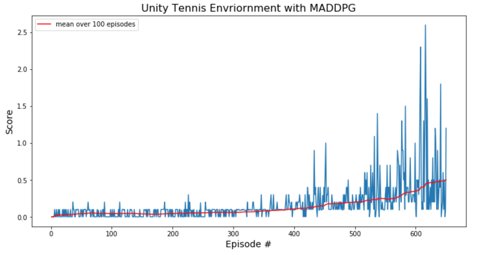

# Project Report

## The Learning Algorithm

The MADDPG algorithm, an extension of DDPG algorithm for multiple agents, employed in this project is inspired from the seminal paper entitled - off-policy, model-free policy gradient model inspired from the seminal paper entitled - *Multi-Agent Actor-Critic for Mixed Cooperative-Competitive Environments* (Ryan Lowe, Yi Wu, Aviv Tamar, Jean Harb, Pieter Abbeel, Igor Mordatch). For each agent, two neural networks - one for the actor, and the other for the crtic - are trained to solve the Unity Tennis Environment (see `Model Architecture` for more details). The actor network takes in 48-dimensional input and outputs a 2-dimensional vector corresponding to the movement toward or away from net, and jumping. The critic network, on the other hand, takes in 48-dimensional (24 [state space for one agent] * 2 [number of agents]) state space, and 4-dimensional (2 [action space for one agent] * 2 [number of agents]) action space to output a single continuous value representing the Q-value. This architecture is inspired from the paper (referenced above) which suggests a `centralized training and decentralized execution` approach (refer the paper for more details), with a slight variation that instead of the actor network of an agent taking in just its own obeservational state space (24-dimension), it now takes also takes in the other agent's state space (making the total input a 24 * 2 dimensional vector).


### Model Architecture
- Actor (for both the agents)
```
Actor(
  (fc1): Linear(in_features=24*2, out_features=256, bias=True)
  (fc2): Linear(in_features=256, out_features=128, bias=True)
  (fc3): Linear(in_features=128, out_features=2, bias=True)
)
```

- Critic (for both the agents)
```
Critic(
  (fcs1): Linear(in_features=24*2, out_features=256, bias=True)
  (fc2): Linear(in_features=256+2*2, out_features=128, bias=True)
  (fc3): Linear(in_features=128, out_features=1, bias=True)
)
```

### Hyperparameters
The following are the choice of the hyperparameters:
- Replay Buffer Size (BUFFER_SIZE): 1000000
- Batch Size (BATCH_SIZE): 128
- Discount Rate (GAMMA): 0.99
- Soft Update Rate (TAU): 0.06
- Learning Rate 
	- Actor (LR_ACTOR): 0.0001
	- Critic (LR_CRITIC): 0.0001
- Max episodes (n_episodes): 10000
- Adam optimizer weight decay for Critic(WEIGHT_DECAY): 0
- Ornstein-Uhlenbeck process
	- mu: 0
	- theta: 0.13
	- sigma: 0.2
- Time steps between network updates (N_UPDATES): 1
- Number of times training (N_UPDATES): 1
- Noise level start (eps_start): 6
- Noise level end (eps_end): 0
- Noise decay rate (eps_decay): 250

## Plot of Rewards

The environment is considered to be solved if the agents get an average score of +0.5 (over 100 consecutive episodes, after taking the maximum over both agents). The implemented algorithm could solve the environment in under 600 episodes.




```
Episode: 50 Max Reward: 0.090 Average (Max) Reward: 0.042
Episode: 100  Max Reward: 0.000 Average (Max) Reward: 0.043
Episode: 150  Max Reward: 0.000 Average (Max) Reward: 0.039
Episode: 200  Max Reward: 0.100 Average (Max) Reward: 0.046
Episode: 250  Max Reward: 0.000 Average (Max) Reward: 0.055
Episode: 300  Max Reward: 0.000 Average (Max) Reward: 0.058
Episode: 350  Max Reward: 0.100 Average (Max) Reward: 0.080
Episode: 400  Max Reward: 0.100 Average (Max) Reward: 0.106
Episode: 450  Max Reward: 0.200 Average (Max) Reward: 0.154
Episode: 500  Max Reward: 0.200 Average (Max) Reward: 0.198
Episode: 550  Max Reward: 0.300 Average (Max) Reward: 0.245
Episode: 600  Max Reward: 0.100 Average (Max) Reward: 0.353
Episode: 650  Max Reward: 1.200 Average (Max) Reward: 0.502

Environment solved in 550 episodes! Average Reward: 0.502
```

## Future Work
The agent could be improved by exploring the following ideas:

- [Proximal Policy Optimization](https://arxiv.org/abs/1707.06347) - as a substitute for DDPG 
- [Prioritized Experience Replay](https://arxiv.org/abs/1511.05952) - as an enhancement to plain vanilla Replay Buffer.
- Implementing a common Replay Buffer insted of a seperate one for each agents. 
- Fine tuning the hyperparameters such as the OUNoise parameters, Actor and Critic architectures.
- Solving a more challenging Soccer Unity Environment with 6+4-dimensional discrete action space and 112-dimensional obervation space. 